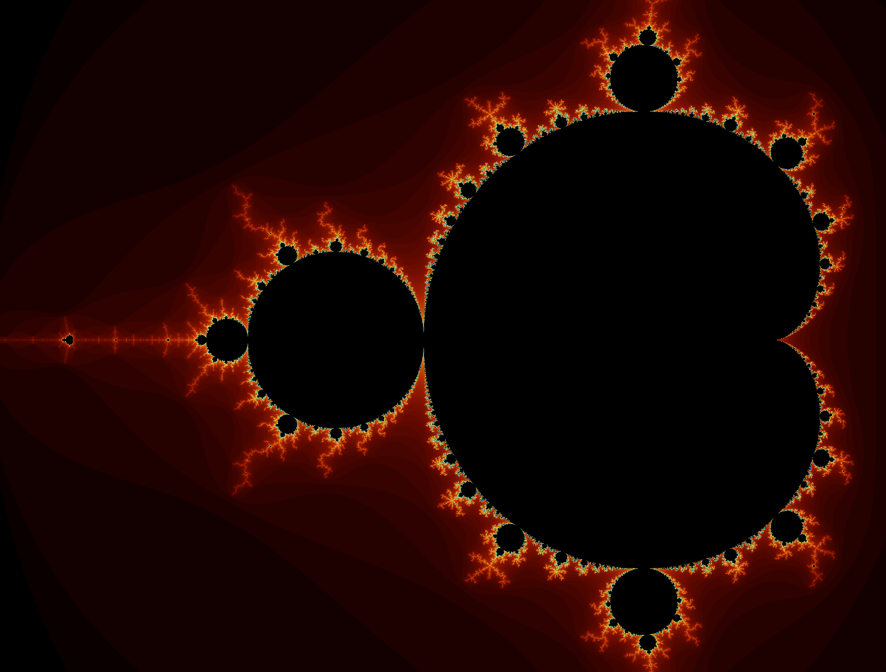

# zig-opengl-test

Trying to display a Mandelbrot set visualization with Zig and OpenGL shaders.

## Build
Using [gyro](https://github.com/mattnite/gyro):

```
gyro build install -Drelease-fast
```

## Screenshots

